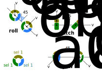

Client Rotations
================

The image bellow complements the textual explanation of the *roll*, *pitch*,
and *yaw* angles, and how we calculate them.

.. argparse::
   :module: taurenmd.cli_rotations
   :func: _ap
   :prog: tmdrotations
   :markdownhelp:
