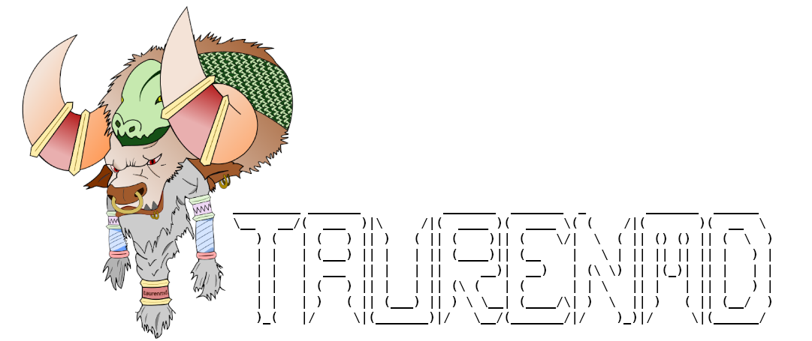

# Summary

Computational simulations of biological molecules, coined Molecular Dynamics (MD), have evolved drastically since its application was firstly demonstrated four decades ago [@Karplus1977]; simulation of systems which account for millions of atoms is now possible thanks to the latest advances in computation and data storage capacity -- and community's interest is growing [@Hollingsworth2018]. Academic groups development most of the MD methods and software for data handling and analysis and, specially the latter, is key to the adoption of the MD techniques by the general research community. While the MD analysis libraries developed solely for manipulating raw data and generating structural parameters nicely address these needs [@mda1; @mda2; @mdt; @Romo2014; @Roe2013], each of these have its advantages and drawbacks, inherit to their implementation strategies. Yet, one has to appreciate this diversity enriches the field with a panoply of strategies that the community can take profit of.

The MD analysis software libraries widely distributed and adopted by the community share two main characteristics: 1) they are written in pure Python [@CS-R9526], or provide a Python interface and 2) they are *libraries*: highly versatile and powerful pieces of software that, as a counterpart, require advanced scripting and understanding to be operated, even for their basic functionalities. While this is the correct approach to develop computational libraries, it marks a breach between these software packages and the *non-developer* researcher and/or high throughput practices, specially for daily data handling routines. Emerges, therefore, the need to create a platform that efficiently combines the MD libraries available in the Python universe, taking the most out of each, and implements a quick-draw interface for daily usage by both experts and non-experts in the field. Here is presented **taurenmd** \autoref{fig:logo}, an easy-to-use and extensible command-line interface ecosystem that routinizes complex Molecular Dynamics analysis operations by building on top of powerful Python-based MD analysis libraries.



# Implementation

**taurenmd** provides highly parametrizable command-line interfaces that automatize complex operations of Molecular Dynamics (MD) data handling and analysis in unitary executions, which, *per se*, represent conceptual ideas; for example, the manipulation of raw MD data or the calculation of structural parameters (*RMSDs, RMSFs, etc...*). Command-line operations are workflows defined by orchestrated single-operation functions. These single-logic functions are coded in the core of *taurenmd*'s library which facilitates their unit-testing and sharing among all interfaces. *taurenmd*'s architecture design is, therefore, simple, yet highly modular, flat, easy to read, and extensible. *taurenmd* serves as a hub of routines in continuous growth, where new operations can be implemented and shared among the community in a defined and documented manner. *taurenmd* project is hosted at GitHub (https://github.com/joaomcteixeira/taurenmd) and full documentation is available at ReadTheDocs (https://taurenmd.readthedocs.io).

To operate MD data, *taurenmd* uses third-party MD analysis libraries; currently, it imports MDAnalysis [@mda1; @mda2], MDTraj [@mdt] and OpenMM [@OpenMM] and they are used depending on the requirements of each command-line client. But, as stated, the cared design of the program allows facile incorporation of new dependencies to implement or extend new workflows. Finally, though *taurenmd* focus on enhanced combination of third party libraries, its design leaves room to the implementation of original analysis routines when needed.

The command-line interface of *taurenmd* is *hierarchic*, where `taurenmd` is the main entry point and the different interfaces exist as *subroutines*, for example:

```bash
# help instructions for the main taurenmd entry point
$ taurenmd -h
# an execution example
$ taurenmd [SUBROUTINE] [OPTIONS]
# querying help for a specific subroutine
$ taurenmd report -h
```

At the date of publication, *taurenmd* provides ten different command-line interfaces; all of them, their arguments, and functionalities, are thoroughly described in the project's documentation under *Command-line interfaces*. Likewise, all individual functional operations provided are open, fully documented, and can be imported and used by other projects if desired.

To invite community contributions, a client template file is provided with detailed instructions to guide the implement of new command-line workflows. The building blocks required to build command-line clients are also extensively documented in the `libs/libcli.py` module, where new blocks can also be added if needed. New logical operations can simply be implemented in the library core and used in clients. Complete instructions on how to contribute to the project are provided in the documentation. The project provides extensive Continuous Integration tests and explicit style and format configurations to guide developers. *taurenmd* follows Semantic Versioning 2.0 and we favor agile develop/deployment.

# Installation

**taurenmd** is deployed in the Python ecosystem and is available for direct down at PyPI (https://pypi.org/project/taurenmd/):

```bash
$ pip3 install taurenmd[all]
```

*taurenmd* code uses only Python provided interfaces and is, therefore, compatible with any platform compatible with Python. However, the different Molecular Dynamics analysis libraries imported have very different deployment strategies and we cannot guarantee those will function in all OSes; we do guarantee *taurenmd* works fully on Ubuntu 18.04 LTS running Anaconda as Python package manager. We advise reading the detailed installation instructions provided in the project's documentation.

# Use cases

*taurenmd* current version has ten command-line interfaces that execute different analysis or data manipulation routines. Extensive usage examples are provided in the documentation website or by the command:

```bash
$ taurenmd -h
```

Here we show a very common case where `trajedit` interface is used for data manipulation and transformation:

```bash
$ taurenmd trajedit topology.pdb trajectory.xtc -d traj_s50_e500_p10.xtc \
> -s 50 -e 500 -p 10 -l 'segid A'
```

The latter extracts a subtrajectory spanning frames 50 to 500 (exclusive) with a step interval of 10 frames, and only for atoms for the `'segid A'` atom group; in this particular case, we make use of MDAnalysis library [@mda1; @mda2] to handle the data.

# Acknowledgments

The initial concept of this project was largely inspired in the pdb-tools project `one script one action` idea [@pdbtools]; here we pushed that concept further. The author deeply thanks João P.G.L.M. Rodrigues (ORCID: 0000-0001-9796-3193) for mentoring on MD simulations and data analysis and to Susana Barrera-Vilarmau (ORCID: 0000-0003-4868-6593) for her intensive usage of the program since the very first versions and all the discussions, feedback and suggestions on building a user-friendly interface. The project's repository layout and Continuous Integration setup was based on `cookiecutter-pylibrary` [@cc] with final personal modifications by J.M.C.T..

# References
